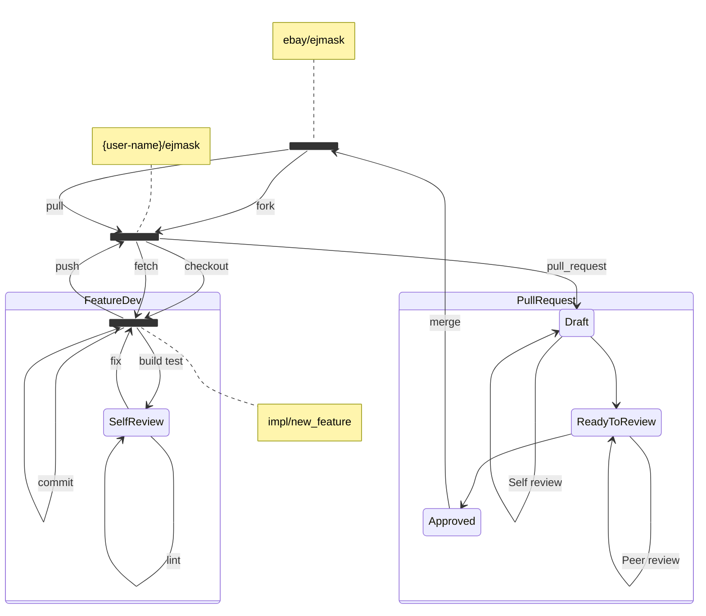

# eJMask Contribution Guidelines

Thank you so much for wanting to contribute to eJMask! Here are a few important things you should know about contributing:

1. API changes require discussion, use cases, etc. Code comes later.
2. Pull requests are great for small fixes for bugs, documentation, etc.
3. Code contributions require updating relevant documentation.

This project takes all contributions through [pull requests][pull-request-blog]. Code should *not* be pushed directly to `master`.

The following guidelines apply to all contributors.

## Types of contributions

All types of contributions, from minor documentation changes to new capabilities, performance improvements, extending tests, etc., are all welcome.

## Making Changes

* Fork the `eJMask` repository.
* Make your changes and push them to a topic branch in your fork.
* See our commit message guidelines further down in this document.
* Submit a pull request to the repository.
* Update the `eJMask` GitHub issue with the generated pull request link.

### Git Workflow

1. Go to GitHub and fork the repository [ebay/ejmask][fork-repo].
2. Clone your fork to your local workspace:
    ```commandline
    git clone git@github.com:<user-name>/ejmask.git
    ```
3. Create a new [feature branch][create-branch].
4. Make your changes, perform a self-review, build, and test.
5. Push your changes to the [remote fork][push-commits].
6. Raise a [pull request][create-pr].


> Please keep your branch up to date by [rebasing][rebase-git] upstream changes from the develop branch.

## Development
### Pre-requisites
- JDK 8
- Maven 3.6.3
- python3 (for development scripts)

### General Guidelines

* Only one logical change per commit.
* Do not mix whitespace changes with functional code changes.
* Do not mix unrelated functional changes.
* When writing a commit message:
  * Describe *why* a change is being made.
  * Do not assume the reviewer understands what the original problem was.
  * Do not assume the code is self-evident/self-documenting.
  * Describe any limitations of the current code.
* Any significant changes should be accompanied by tests.
* The project already has good test coverage, so look at some of the existing tests if you're unsure how to go about it.
* Please squash all commits for a change into a single commit (this can be done using `git rebase -i`).

### Versioning
* We are using [Semantic Versioning](https://semver.org/). 
* We are following the format `MAJOR.MINOR.PATCH`.
  * `MAJOR` : fundamental changes.
  * `MINOR` : incompatible changes.
  * `PATCH` : backward-compatible changes & bug fixes.
* Use `version_update.py` to update the version in the `pom.xml` file.
* Use snapshot versions for development & testing 
* Update the version to release when you commit. 

### Java Guidelines

- Please make sure:
  * Source code is always formatted before commit.
  * You remove all unused imports.
  * Usage of `@Override`.
- Please avoid:
  * Trailing whitespace on all lines.
  * All unused imports.
  * Empty blocks.

### Build
```shell
mvn clean install --settings settings.xml --batch-mode
```

### Commit Message Guidelines
* 
* Provide a brief description of the change in the first line.
* Insert a single blank line after the first line.
* Provide a detailed description of the change in the following lines, breaking paragraphs where needed.
* The first line should be limited to 50 characters and should not end in a period.
* Subsequent lines should be wrapped at 72 characters.

## Pull Request Guidelines

- Ensure the pull request has a description of the change.
- Ensure the pull request has a proper title describing the change.
  - Prefix the title with:
    - `IMPL` for a new change.
    - `FIX` for a bug fix.
    - `DOC` for a documentation change.
    - `DEV` for refactoring.
  - For `IMPL` and non-compatible refactoring or bug fixes, increment the version to the next major (e.g., `1.0.0` -> `1.1.0`).
  - For all other changes, increment the minor version (e.g., `1.0.0` -> `1.0.1`).
    > eg: DEV: Refactored the code to use a new pattern builder

[create-branch]: https://docs.github.com/en/pull-requests/collaborating-with-pull-requests/proposing-changes-to-your-work-with-pull-requests/creating-and-deleting-branches-within-your-repository
[create-pr]: https://docs.github.com/en/pull-requests/collaborating-with-pull-requests/proposing-changes-to-your-work-with-pull-requests/creating-a-pull-request-from-a-fork
[clone-repo]: https://docs.github.com/en/repositories/creating-and-managing-repositories/cloning-a-repository
[fork-repo]: https://docs.github.com/en/pull-requests/collaborating-with-pull-requests/working-with-forks/fork-a-repo
[push-commits]: https://docs.github.com/en/get-started/using-git/pushing-commits-to-a-remote-repository
[pull-request-blog]: https://help.github.com/articles/using-pull-requests
[rebase-git]: https://docs.github.com/en/get-started/using-git/about-git-rebase
